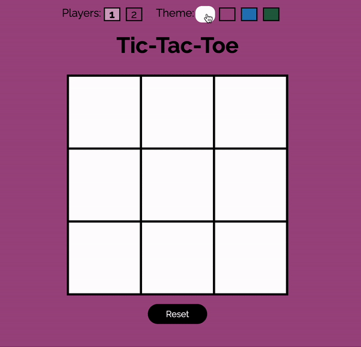

# Tic-Tac-Toe
A simple tic-tac-toe game with single player and two player functionality. You can customize your experience by changing the color scheme and the style of the board.

**Link to project:** https://100devs---tictactoe.glitch.me/

## How It's Made:

**Tech used:** HTML, CSS, JavaScript

## Lessons Learned:

Working on this project helped me build a deeper understanding of how JavaScript and CSS interact with each other. Up until this project much of my experince with JavaScript was solving coding challenges. I quickly discovered that working on a project is similar to solving coding challenges,  you just have to create the challenge based on what you want your code to do. I also learned a lot about debugging my code while building this project.   

WARNING - this code is not object oriented at all, however it does contain one   
object. I look forward to learning more about OOP in the future, and refactoring this code to be more object oriented. 

